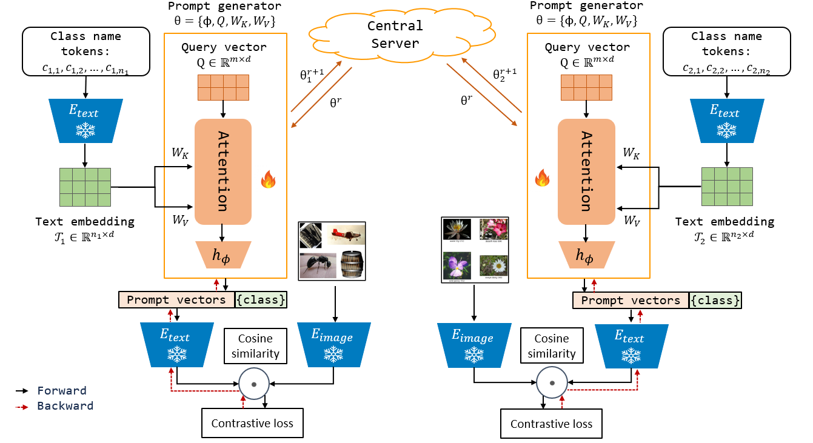

# Federated Text-driven Prompt Generation for Vision-Language Models [ICLR 2024]

This is the companion code for the implementation of FedTPG proposed in the ICLR
2024 paper [Federated Text-driven Prompt Generation for Vision-Language Models](https://openreview.net/forum?id=NW31gAylIm) by Chen Qiu et al. The code allows the users to reproduce and
extend the results reported in the study. Please cite the above paper when
reporting, reproducing or extending the results.

## Purpose of the project

This software is a research prototype, solely developed for and published as
part of the publication. It will neither be
maintained nor monitored in any way.


## Approach

Existing prompt learning
techniques replace hand-crafted text prompts with learned vectors that offer improvements
on seen classes, but struggle to generalize to unseen classes. Our work
addresses this challenge by proposing Federated Text-driven Prompt Generation
(FedTPG), which learns a unified prompt generation network across multiple remote
clients in a scalable manner. The prompt generation network is conditioned
on task-related text input, thus is context-aware, making it suitable to generalize
for both seen and unseen classes.

<div align="left">
  
</div>


## How to install

### Manage your environment:

```bash
$ conda create -n fedtpg python=3.8
$ conda activate fedtpg
$ conda install pytorch==1.12.1 torchvision==0.13.1 cudatoolkit=10.2 -c pytorch
$ pip install -r requirements.txt
```

### Prepare the data:
Please refer to [CoOP](https://github.com/KaiyangZhou/CoOp/tree/main) for data preparation. 


## How to run

### Training
Please run the command for training a model:

```bash
python Launch_FL.py --root YOUR_DATA_PATH --exp_name $1 --model_name $2 --num_cls_per_client NUM_CLASS_PER_CLIENT --avail_percent PERCENT_AVAIL_CLIENT_PER_ROUND
```
`--exp_name` specifies the class of experiment. It can be `cross_cls` for generalization to seen and unseen classes, `cross_data` for generalization to unseen datasets, or `cross_domain` for generalization to unseen data variants.

`--model_name` specifies the method. It can be `fedtpg` for our proposed FedTPG, `coop` for a federated variant of CoOp (and with `--w 8` for KgCoOp), or `vlp` for a federated variant of Vision-Language prompt learning. 


### Evaluating the trained models

1. run the command for testing a trained FedTPG model for the experiment `cross_cls`: 

```bash
python Launch_FL.py --root YOUR_DATA_PATH --exp_name cross_cls --model_name fedtpg --eval-only --model-dir output/cross_cls/fedtpg/20_8/43/ --load-epoch 500
```

2. run the command for testing a trained FedTPG model for the experiment `cross_data`: 

```bash
python Launch_FL.py --root YOUR_DATA_PATH --exp_name cross_data --model_name fedtpg --eval-only --model-dir output/cross_data/fedtpg/5_8/43/ --load-epoch 500
```

## License

FedTPG is open-sourced under the AGPL-3.0 license. See the
[LICENSE](LICENSE) file for details.

For a list of other open source components included in FedTPG, see the
file [3rd-party-licenses.txt](3rd-party-licenses.txt).
